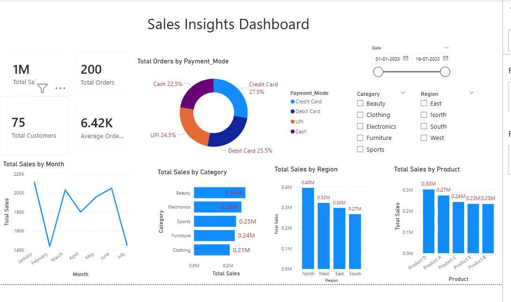

# Sales Insights Dashboard (Power BI)

An interactive Sales Insights Dashboard built in **Power BI** using 200+ retail sales records.  
The report provides a clear view of key business metrics such as total sales, orders, customers, category performance, product performance, and payment method distribution.

---

## 📊 Dashboard Overview

### Key Metrics (KPIs)
- **Total Sales**
- **Total Orders**
- **Total Customers**
- **Average Order Value**

### Visualizations Included
- **Donut Chart** – Order distribution by Payment Mode  
- **Line Chart** – Monthly Sales Trend  
- **Bar Charts** – Sales by Category, Region, and Product  
- **Interactive Filters** – Date, Category, Region  

---

## 🛠️ Tools & Skills Used
- **Power BI**: DAX measures, slicers, data modeling, visuals  
- **Excel**: Data cleaning & preparation  
- **Data Analysis**: Trend identification & business insights  

---

## 📁 Project Files
- `Sales_Insights_Dashboard.pbix` – Power BI report file  
- `Sales_Insights_dataset.xlsx` – Dataset used  
- `dashboard_preview.png` – Screenshot of the final dashboard  

---

## 📷 Dashboard Preview  
*(Add your screenshot file and it will show automatically)*  

---

## 📌 About  
This project demonstrates beginner–intermediate skills in **Power BI, Excel, and Data Analytics**, suitable for roles like Data Analyst, Business Analyst, and Intelligent Automation roles.
